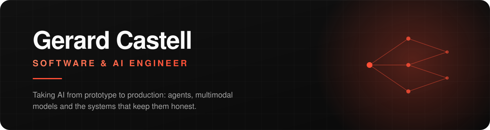

<p align="center">
  <picture>
    <source media="(prefers-color-scheme: dark)" srcset="./assets/banner-dark.svg">
    <source media="(prefers-color-scheme: light)" srcset="./assets/banner-light.svg">
    
  </picture>
</p>

<p align="center">
  <a href="https://www.gerardcastell.dev"></a>
  <a href="https://www.linkedin.com/in/gerardcastell/"></a>
  <a href="mailto:ge.castell@outlook.com"></a>
</p>

---

### About

Software & AI Engineer at **[MANGO](https://www.mango.com)**, where I work on the IRIS virtual assistant and
the platform around it. I spend most of my time on the unglamorous half of AI: evaluation,
observability, guardrails, cost and latency. That is what decides whether a demo
survives contact with production traffic.

- 🤖 Architected an **autonomous agent ecosystem** for task delegation and decision-making inside the assistant
- 📊 Built a **production monitoring & evaluation system** for GenAI (tracing, evals, feedback loops)
- 🖼️ Shipped **multimodal (text + vision)** capabilities and fine-tuned models under strict privacy constraints
- ⚙️ Automated internal workflows with GenAI for a **>30% efficiency gain**
- 🎓 MSc in Artificial Intelligence (UNIR, 9.5/10) · BSc Computer Science Engineering (UPC, 9.3/10)

### Currently

`multi-agent architectures` &nbsp;·&nbsp; `RAG that survives real corpora` &nbsp;·&nbsp; `eval-driven AI development` &nbsp;·&nbsp; `self-hosted inference on consumer GPUs`

---

### Selected work

| Project | What it is | Stack |
| --- | --- | --- |
| **[Self-Hosted RAG Notebook](https://github.com/gerard-castell/rag-project)** | Hybrid dense + sparse RAG over your own PDFs, with a VRAM time-sharing scheduler so retrieval and generation share a single 6&nbsp;GB GPU | `FastAPI` `Qdrant` `llama.cpp` `Gemma` `Next.js` |
| **[IRIS Customer Assistant](https://www.gerardcastell.dev)** · MANGO | Production conversational assistant: intent detection, generative answers, agentic task delegation, full eval harness | `Python` `Dialogflow CX` `Vertex AI` `GCP` |
| **[PII Multimodal Anonymizer](https://www.gerardcastell.dev)** · MANGO | GDPR-compliant anonymization pipeline over images and video using fine-tuned YOLOv8 detectors | `PyTorch` `YOLOv8` `OpenCV` |
| **[Realtime Traffic Sign Detection](https://www.gerardcastell.dev)** | Low-latency detector designed for edge-oriented inference | `PyTorch` `OpenCV` `CNN` |
| **[Portfolio](https://www.gerardcastell.dev)** | Chat-driven portfolio: the whole CV explored through a conversational UI | `Next.js 16` `React 19` `Tailwind v4` `GSAP` |

> Work marked **· MANGO** lives in private company repositories. Write-ups and demos are on [gerardcastell.dev](https://www.gerardcastell.dev).

---

### Stack

**AI & ML**


**Backend & Infra**


**Frontend**


---

### GitHub

<p align="center">
  <picture>
    <source media="(prefers-color-scheme: dark)" srcset="https://github-readme-stats.vercel.app/api?username=gerard-castell&show_icons=true&hide_border=true&include_all_commits=true&icon_color=ff4f36&title_color=ff4f36&text_color=a3a3a3&bg_color=0d1117">
    
  </picture>
  <picture>
    <source media="(prefers-color-scheme: dark)" srcset="https://github-readme-stats.vercel.app/api/top-langs/?username=gerard-castell&layout=compact&hide_border=true&langs_count=8&title_color=ff4f36&text_color=a3a3a3&bg_color=0d1117">
    
  </picture>
</p>

---

### Experience

```text
Mar 2025 - now    Software & AI Engineer    MANGO · Barcelona
                  Agent architectures, GenAI evaluation & observability, multimodal, fine-tuning

Jun 2023 - 2025   Software Engineer         MANGO · Barcelona
                  IRIS virtual assistant: NLU optimization, computer vision module, GCP microservices

Jun 2022 - 2023   Software Engineer Intern  MANGO · Barcelona
                  Microservices, legacy refactors, first hands on GCP
```

---

<p align="center">
  <b>Open to conversations about applied AI, agent systems and production ML.</b><br>
  <a href="https://www.gerardcastell.dev">gerardcastell.dev</a> &nbsp;·&nbsp;
  <a href="https://www.linkedin.com/in/gerardcastell/">LinkedIn</a> &nbsp;·&nbsp;
  <a href="mailto:ge.castell@outlook.com">ge.castell@outlook.com</a>
</p>
